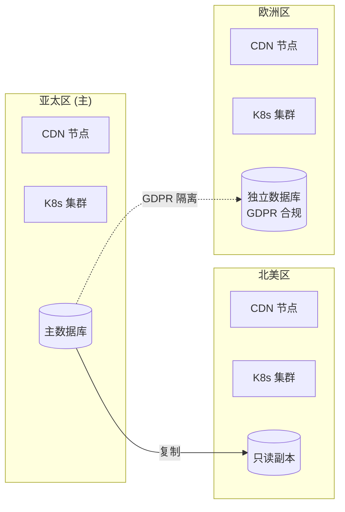
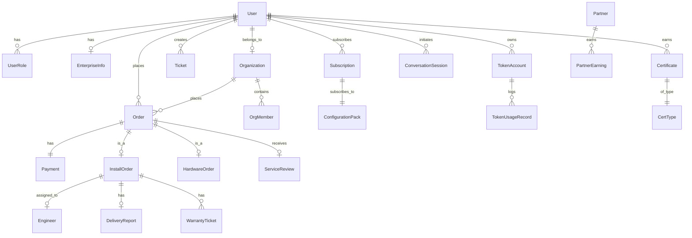

# 技术设计文档：OpenClaw Club 全球化服务平台

## 概述

OpenClaw Club 是一个面向全球用户的 OpenClaw 全生命周期服务平台。平台以 AI 对话式客服（AI_Concierge）为核心交互入口，提供安装服务（闪修侠 O2O 模式）、配置包订阅、AI Token 聚合（Token_Hub）、硬件商城（ClawBox）、培训认证、企业服务和全球化运营等能力。

核心技术选型：
- **用户端前端**：Vue 3 + Vant 4，H5 和桌面端统一代码库，响应式自适应，Vite 构建
- **管理后台前端**：Vue 3 + Element Plus，适合数据密集型后台管理界面
- **服务端**：NestJS (Node.js + TypeScript)，微服务架构，前后端语言统一，TypeORM 对接 PostgreSQL
- **认证与授权**：Logto（开源，MIT 协议，自部署），基于 OIDC/OAuth 2.1，内置 RBAC、多租户、社交登录和 MFA
- **AI Token 聚合**：自建 Token_Hub（NestJS），兼容 OpenAI API 格式，聚合多家模型提供商，Node.js Stream 处理流式响应
- **AI 客服**：基于 Token_Hub 调用大模型，对话式交互替代传统表单
- **全球化**：7 种核心语言，3 大区域服务中心（亚太/北美/欧洲），UTC 时间戳 + vue-i18n 前端本地化
- **支付**：担保交易模式，集成 Stripe/PayPal/支付宝/微信支付

平台的商业模式围绕"安装服务引流 → Token_Hub 持续变现"展开：安装 OpenClaw 时默认接入 Token_Hub，用户每次 AI 调用都通过 Token_Hub 路由和计费，形成随用户量自然增长的长尾收入。

## 架构

### 整体架构

平台采用前后端分离的微服务架构，按业务域划分为多个独立服务。

```mermaid
graph TB
    subgraph "客户端层"
        WEB[用户端<br/>Vue 3 + Vant 4<br/>H5/桌面端自适应]
        ADMIN[管理后台<br/>Vue 3 + Element Plus]
        AI_WIDGET[AI_Concierge 对话组件]
    end

    subgraph "API 网关层"
        GW[API Gateway<br/>Kong/Nginx]
        AUTH[Logto 认证服务<br/>OIDC/OAuth 2.1]
    end

    subgraph "核心业务服务层 (NestJS)"
        USER_SVC[用户服务]
        ORDER_SVC[订单服务]
        INSTALL_SVC[安装服务]
        SUB_SVC[订阅服务]
        CERT_SVC[培训认证服务]
        ENTERPRISE_SVC[企业服务]
        TICKET_SVC[工单服务]
        PARTNER_SVC[合作伙伴服务]
        HW_SVC[硬件商城服务]
    end

    subgraph "AI 服务层 (NestJS)"
        CONCIERGE[AI_Concierge 服务]
        TOKEN_HUB[Token_Hub 聚合网关]
        ROUTER[智能路由引擎]
    end

    subgraph "平台服务层"
        I18N[国际化服务<br/>Localization_Engine]
        PAY[支付服务<br/>担保交易]
        NOTIFY[通知服务<br/>邮件/站内/推送]
        ANALYTICS[数据分析服务]
        SECURITY[安全审计服务]
        DISPATCH[智能派单引擎]
    end

    subgraph "数据层"
        PG[(PostgreSQL<br/>主数据库)]
        REDIS[(Redis<br/>缓存/会话)]
        ES[(Elasticsearch<br/>搜索/日志)]
        S3[(对象存储<br/>文件/报告)]
        MQ[消息队列<br/>RabbitMQ]
    end

    subgraph "外部服务"
        LOGTO_EXT[Logto 实例]
        OPENAI[OpenAI API]
        ANTHROPIC[Anthropic API]
        GOOGLE_AI[Google AI API]
        CN_LLM[国产大模型 API]
        STRIPE[Stripe]
        PAYPAL[PayPal]
        ALIPAY[支付宝/微信支付]
        GITHUB_EXT[GitHub OAuth]
        FEISHU[飞书 API]
        DINGTALK[钉钉 API]
    end

    WEB --> GW
    ADMIN --> GW
    AI_WIDGET --> GW
    GW --> AUTH
    AUTH --> LOGTO_EXT
    GW --> USER_SVC
    GW --> ORDER_SVC
    GW --> INSTALL_SVC
    GW --> SUB_SVC
    GW --> CERT_SVC
    GW --> ENTERPRISE_SVC
    GW --> TICKET_SVC
    GW --> PARTNER_SVC
    GW --> HW_SVC
    GW --> CONCIERGE
    GW --> TOKEN_HUB

    CONCIERGE --> TOKEN_HUB
    TOKEN_HUB --> ROUTER
    ROUTER --> OPENAI
    ROUTER --> ANTHROPIC
    ROUTER --> GOOGLE_AI
    ROUTER --> CN_LLM

    ORDER_SVC --> PAY
    PAY --> STRIPE
    PAY --> PAYPAL
    PAY --> ALIPAY

    INSTALL_SVC --> DISPATCH
    ORDER_SVC --> MQ
    NOTIFY --> MQ

    USER_SVC --> PG
    ORDER_SVC --> PG
    TOKEN_HUB --> PG
    ANALYTICS --> ES
    SECURITY --> ES

```



### 关键架构决策

| 决策 | 选择 | 理由 |
|------|------|------|
| 认证方案 | Logto 自部署 | 开源 MIT 协议，内置 RBAC/MFA/多租户/社交登录，基于 OIDC 标准，避免供应商锁定 |
| 服务端框架 | NestJS (Node.js + TypeScript) | 前后端语言统一（TypeScript 全栈），微服务架构原生支持，依赖注入/模块化设计，Node.js Stream 适合 Token_Hub 流式响应 |
| ORM | TypeORM | TypeScript 原生支持，与 NestJS 深度集成，支持 PostgreSQL、迁移管理、多租户 |
| AI 网关 | 自建 Token_Hub (NestJS) | 核心收入引擎，需完全掌控路由、计费和审计逻辑，兼容 OpenAI API 格式降低接入成本 |
| 用户端前端 | Vue 3 + Vant 4 | Vant 4 原生支持 H5 和桌面端自适应，组件丰富，中文生态好，适合全球化 SaaS 平台 |
| 管理后台前端 | Vue 3 + Element Plus | 表格/表单/图表组件丰富，适合数据密集型后台管理，与用户端共享 Vue 3 技术栈 |
| 构建工具 | Vite | Vue 3 官方推荐，开发热更新快，生产构建高效 |
| 数据库 | PostgreSQL | 支持 JSONB、全文搜索、分区表，适合多租户和国际化场景 |
| 消息队列 | RabbitMQ | 支持延迟消息（订单超时）、死信队列（失败重试），适合订单和通知场景 |
| 搜索/日志 | Elasticsearch | 支持多语言分词、审计日志聚合查询、实时分析 |
| 缓存 | Redis | 会话管理、权限缓存、Token 用量实时计数、限流 |
| 支付 | Stripe + 本地支付 | Stripe 覆盖全球信用卡/PayPal，支付宝/微信支付覆盖中国市场 |

### 部署架构



欧洲区因 GDPR 要求采用独立数据库，用户数据不出欧洲区域。亚太区为主区域，北美区使用只读副本加速读取。

## 组件与接口

### 1. 用户服务 (User Service)

负责用户生命周期管理，与 Logto 协同完成认证授权。

```typescript
interface UserService {
  // 用户注册后回调，补充平台业务数据
  completeProfile(userId: string, profile: UserProfile): Promise<User>;
  // 选择账户类型
  selectAccountType(userId: string, type: 'individual' | 'enterprise'): Promise<void>;
  // 补充企业信息
  updateEnterpriseInfo(userId: string, info: EnterpriseInfo): Promise<void>;
  // 获取用户完整信息（含角色、权限）
  getUserWithRoles(userId: string): Promise<UserWithRoles>;
  // 为用户追加角色（通过 Logto API）
  assignRole(userId: string, role: RoleType): Promise<void>;
  // 创建企业组织空间（通过 Logto Organization）
  createOrganization(enterpriseUserId: string, orgInfo: OrgInfo): Promise<Organization>;
  // 邀请成员加入组织
  inviteMember(orgId: string, email: string, role: RoleType): Promise<Invitation>;
}

type RoleType = 'admin' | 'support_agent' | 'trainer' | 'certified_engineer'
  | 'partner_community' | 'partner_regional' | 'enterprise_user' | 'individual_user';
```

### 2. 安装服务 (Installation Service)

管理安装服务全流程：AI 对话采集需求 → 智能派单 → 服务执行 → 验收 → 质保。

```typescript
interface InstallationService {
  // AI_Concierge 生成的服务方案
  createServicePlan(conversationId: string, plan: ServicePlan): Promise<ServicePlan>;
  // 用户确认方案后创建安装订单
  createInstallOrder(userId: string, planId: string): Promise<InstallOrder>;
  // 智能派单
  dispatchOrder(orderId: string): Promise<DispatchResult>;
  // 工程师接单
  acceptOrder(orderId: string, engineerId: string): Promise<void>;
  // 更新服务进度
  updateProgress(orderId: string, status: InstallStatus): Promise<void>;
  // 提交服务交付报告
  submitDeliveryReport(orderId: string, report: DeliveryReport): Promise<void>;
  // 用户确认验收
  confirmAcceptance(orderId: string, userId: string): Promise<void>;
  // 用户评价
  submitReview(orderId: string, review: ServiceReview): Promise<void>;
  // 申请返修
  requestWarrantyRepair(orderId: string, issue: string): Promise<WarrantyTicket>;
}

type InstallStatus = 'accepted' | 'assessing' | 'installing' | 'configuring'
  | 'testing' | 'pending_acceptance';

type ServiceTier = 'standard' | 'professional' | 'enterprise';

interface ServicePlan {
  tier: ServiceTier;
  deviceEnv: DeviceEnvironment;
  estimatedDuration: number; // 分钟
  price: number;
  includesTokenHub: boolean; // 默认 true
  ocsasLevel: 1 | 2 | 3;
}
```

### 3. Token_Hub 聚合网关

核心收入引擎，聚合多家 AI 模型提供商，提供统一 API 接口。

```typescript
interface TokenHubGateway {
  // 兼容 OpenAI API 格式的聊天补全接口
  chatCompletion(request: ChatCompletionRequest): Promise<ChatCompletionResponse>;
  // 智能路由：根据任务类型、成本、延迟选择最优模型
  routeRequest(request: ChatCompletionRequest): Promise<ProviderRoute>;
  // 实时计量 Token 消耗
  meterUsage(userId: string, usage: TokenUsage): Promise<void>;
  // 查询用量和费用
  getUsageDashboard(userId: string, period: DateRange): Promise<UsageDashboard>;
  // 充值/购买套餐
  purchaseQuota(userId: string, plan: QuotaPlan): Promise<void>;
  // 企业用量配额管理
  setEnterpriseQuota(orgId: string, quota: EnterpriseQuota): Promise<void>;
  // 故障转移：检测到提供商异常时自动切换
  failover(provider: string, fallbackProvider: string): Promise<void>;
}

interface ChatCompletionRequest {
  model: string;           // 模型标识，如 "gpt-4o", "claude-3.5-sonnet"
  messages: Message[];
  temperature?: number;
  max_tokens?: number;
  stream?: boolean;
  // Token_Hub 扩展字段
  routing_strategy?: 'cost_optimized' | 'speed_optimized' | 'quality_optimized';
}

interface TokenUsage {
  provider: string;
  model: string;
  promptTokens: number;
  completionTokens: number;
  totalTokens: number;
  costUsd: number;        // 平台采购成本
  priceUsd: number;       // 用户计费价格
  timestamp: string;      // ISO 8601 UTC
}
```

### 4. AI_Concierge 服务

对话式 AI 客服，替代传统表单，引导用户完成咨询和下单。

```typescript
interface AIConciergeService {
  // 创建对话会话
  createSession(userId: string, language: string): Promise<ConversationSession>;
  // 发送消息并获取 AI 回复
  sendMessage(sessionId: string, message: UserMessage): Promise<AIResponse>;
  // AI 判断信息收集完毕后生成服务方案
  generateServicePlan(sessionId: string): Promise<ServicePlanCard>;
  // 转接人工客服
  escalateToHuman(sessionId: string, reason: string): Promise<void>;
  // 获取对话历史
  getConversationHistory(sessionId: string): Promise<Message[]>;
}

interface AIResponse {
  content: string;
  richElements?: RichElement[];  // 卡片、按钮、代码块等
  suggestedActions?: Action[];   // 建议操作
  needsEscalation: boolean;     // 是否需要转人工
  collectedInfo?: Partial<ServiceRequirements>; // 已收集的需求信息
}
```

### 5. 订单与支付服务 (Order & Payment Service)

担保交易模式：用户付款 → 冻结至担保账户 → 服务验收 → 释放结算。

```typescript
interface OrderService {
  // 创建订单
  createOrder(userId: string, items: OrderItem[]): Promise<Order>;
  // 支付（冻结至担保账户）
  processPayment(orderId: string, paymentMethod: PaymentMethod): Promise<PaymentResult>;
  // 验收完成后释放款项并结算
  settleOrder(orderId: string): Promise<SettlementResult>;
  // 退款
  requestRefund(orderId: string, reason: string): Promise<RefundRequest>;
  // 生成发票
  generateInvoice(orderId: string, type: 'standard' | 'vat'): Promise<Invoice>;
  // 工程师收入明细
  getEngineerEarnings(engineerId: string, period: DateRange): Promise<EarningsReport>;
}

interface SettlementResult {
  orderId: string;
  totalAmount: number;
  engineerShare: number;    // 80%
  platformShare: number;    // 20%
  currency: string;
  settledAt: string;
}

type PaymentMethod = 'credit_card' | 'paypal' | 'alipay' | 'wechat_pay' | 'bank_transfer' | 'sepa';
```

### 6. 订阅服务 (Subscription Service)

```typescript
interface SubscriptionService {
  // 创建订阅
  subscribe(userId: string, packId: string, cycle: 'monthly' | 'yearly'): Promise<Subscription>;
  // 部署配置包至用户 OpenClaw 实例
  deployPack(subscriptionId: string): Promise<DeployResult>;
  // 自动续费
  processAutoRenewal(subscriptionId: string): Promise<RenewalResult>;
  // 取消订阅
  cancelSubscription(subscriptionId: string): Promise<void>;
  // 推送配置包更新
  pushUpdate(packId: string, version: string): Promise<UpdateResult>;
}
```

### 7. 培训认证服务 (Certification Service)

```typescript
interface CertificationService {
  // 报名课程
  enrollCourse(userId: string, courseId: string): Promise<Enrollment>;
  // 提交考试
  submitExam(userId: string, examId: string, answers: ExamAnswers): Promise<ExamResult>;
  // 颁发证书
  issueCertificate(userId: string, certType: CertType): Promise<Certificate>;
  // 验证证书
  verifyCertificate(certNumber: string): Promise<CertVerification>;
  // 续证
  renewCertificate(certId: string): Promise<Certificate>;
}

type CertType = 'OCP' | 'OCE' | 'OCEA' | 'AI_IMPLEMENTATION_ENGINEER';
```

### 8. 国际化服务 (Localization Engine)

```typescript
interface LocalizationEngine {
  // 检测用户区域和语言
  detectLocale(ip: string, acceptLanguage: string): Promise<LocaleInfo>;
  // 获取翻译资源
  getTranslations(language: SupportedLanguage, namespace: string): Promise<Translations>;
  // 格式化时间为用户时区
  formatDateTime(utcTime: string, timezone: string, locale: string): string;
  // 获取区域支付方式
  getRegionalPaymentMethods(region: Region): PaymentMethod[];
}

type SupportedLanguage = 'zh' | 'en' | 'ja' | 'ko' | 'de' | 'fr' | 'es';
type Region = 'apac' | 'na' | 'eu';
```

### 9. 智能派单引擎 (Dispatch Engine)

```typescript
interface DispatchEngine {
  // 根据多维因素匹配最优工程师
  matchEngineer(order: InstallOrder): Promise<EngineerMatch[]>;
  // 派单超时升级
  escalateDispatch(orderId: string, level: 'expand' | 'manual' | 'external'): Promise<void>;
  // 路由至第三方平台
  routeToExternalPlatform(orderId: string, platform: ExternalPlatform): Promise<void>;
}

interface EngineerMatch {
  engineerId: string;
  score: number;           // 综合匹配分
  skillLevel: number;
  currentLoad: number;     // 当前接单量
  timezoneMatch: boolean;  // 时区匹配
  avgRating: number;       // 历史评分
  responseTime: number;    // 平均响应时间（分钟）
}
```

### 10. 硬件商城服务 (Hardware Store Service)

```typescript
interface HardwareStoreService {
  // 获取产品列表
  listProducts(category: HardwareCategory, region: Region): Promise<Product[]>;
  // 获取产品详情
  getProductDetail(productId: string): Promise<ProductDetail>;
  // 创建硬件订单
  createHardwareOrder(userId: string, items: HardwareOrderItem[]): Promise<HardwareOrder>;
  // 查询物流状态
  getShippingStatus(orderId: string): Promise<ShippingStatus>;
  // 申请售后
  requestAfterSales(orderId: string, type: AfterSalesType): Promise<AfterSalesTicket>;
}

type HardwareCategory = 'clawbox_lite' | 'clawbox_pro' | 'clawbox_enterprise'
  | 'recommended_hardware' | 'accessories';
type AfterSalesType = 'return' | 'exchange' | 'warranty_repair' | 'tech_support';
```


## 数据模型

### 核心实体关系



### 主要数据表

```sql
-- 用户扩展信息（Logto 管理核心身份数据，此表存储平台业务数据）
CREATE TABLE users (
    id UUID PRIMARY KEY,                    -- 与 Logto user ID 一致
    logto_user_id VARCHAR(64) UNIQUE NOT NULL,
    account_type VARCHAR(20) NOT NULL,      -- 'individual' | 'enterprise'
    display_name VARCHAR(100),
    avatar_url TEXT,
    language_preference VARCHAR(5) DEFAULT 'en',  -- ISO 639-1
    timezone VARCHAR(50) DEFAULT 'UTC',           -- IANA timezone
    region VARCHAR(10),                           -- 'apac' | 'na' | 'eu'
    created_at TIMESTAMPTZ NOT NULL DEFAULT NOW(),
    updated_at TIMESTAMPTZ NOT NULL DEFAULT NOW()
);

-- 企业信息
CREATE TABLE enterprise_info (
    id UUID PRIMARY KEY DEFAULT gen_random_uuid(),
    user_id UUID NOT NULL REFERENCES users(id),
    org_id UUID REFERENCES organizations(id),
    company_name VARCHAR(200) NOT NULL,
    industry VARCHAR(50),
    company_size VARCHAR(20),               -- 'small' | 'medium' | 'large' | 'enterprise'
    created_at TIMESTAMPTZ NOT NULL DEFAULT NOW()
);

-- 组织（对应 Logto Organization）
CREATE TABLE organizations (
    id UUID PRIMARY KEY DEFAULT gen_random_uuid(),
    logto_org_id VARCHAR(64) UNIQUE NOT NULL,
    name VARCHAR(200) NOT NULL,
    owner_user_id UUID NOT NULL REFERENCES users(id),
    created_at TIMESTAMPTZ NOT NULL DEFAULT NOW()
);

-- 订单（统一订单表，多态设计）
CREATE TABLE orders (
    id UUID PRIMARY KEY DEFAULT gen_random_uuid(),
    order_number VARCHAR(32) UNIQUE NOT NULL,  -- 唯一订单编号
    user_id UUID NOT NULL REFERENCES users(id),
    org_id UUID REFERENCES organizations(id),
    order_type VARCHAR(20) NOT NULL,           -- 'installation' | 'subscription' | 'course' | 'certification' | 'hardware'
    status VARCHAR(30) NOT NULL DEFAULT 'pending_payment',
    total_amount DECIMAL(12,2) NOT NULL,
    currency VARCHAR(3) NOT NULL DEFAULT 'USD',
    region VARCHAR(10),
    created_at TIMESTAMPTZ NOT NULL DEFAULT NOW(),
    updated_at TIMESTAMPTZ NOT NULL DEFAULT NOW()
);

-- 支付记录（担保交易）
CREATE TABLE payments (
    id UUID PRIMARY KEY DEFAULT gen_random_uuid(),
    order_id UUID NOT NULL REFERENCES orders(id),
    payment_method VARCHAR(20) NOT NULL,
    amount DECIMAL(12,2) NOT NULL,
    currency VARCHAR(3) NOT NULL DEFAULT 'USD',
    status VARCHAR(20) NOT NULL DEFAULT 'pending',  -- 'pending' | 'frozen' | 'released' | 'refunded' | 'failed'
    escrow_frozen_at TIMESTAMPTZ,              -- 冻结至担保账户时间
    escrow_released_at TIMESTAMPTZ,            -- 释放时间
    external_payment_id VARCHAR(128),          -- 第三方支付 ID
    created_at TIMESTAMPTZ NOT NULL DEFAULT NOW()
);

-- 安装服务订单
CREATE TABLE install_orders (
    id UUID PRIMARY KEY DEFAULT gen_random_uuid(),
    order_id UUID NOT NULL REFERENCES orders(id),
    service_tier VARCHAR(20) NOT NULL,         -- 'standard' | 'professional' | 'enterprise'
    ocsas_level INTEGER NOT NULL DEFAULT 1,
    engineer_id UUID REFERENCES users(id),
    conversation_id UUID,                      -- AI_Concierge 对话 ID
    device_environment JSONB,                  -- 设备环境信息
    install_status VARCHAR(30) NOT NULL DEFAULT 'pending_dispatch',
    token_hub_connected BOOLEAN DEFAULT TRUE,
    warranty_end_date DATE,
    warranty_repair_count INTEGER DEFAULT 0,
    dispatched_at TIMESTAMPTZ,
    accepted_at TIMESTAMPTZ,
    completed_at TIMESTAMPTZ,
    accepted_by_user_at TIMESTAMPTZ
);

-- 服务交付报告
CREATE TABLE delivery_reports (
    id UUID PRIMARY KEY DEFAULT gen_random_uuid(),
    install_order_id UUID NOT NULL REFERENCES install_orders(id),
    checklist JSONB NOT NULL,                  -- 安装清单
    config_items JSONB NOT NULL,               -- 配置项
    test_results JSONB NOT NULL,               -- 测试结果
    screenshots TEXT[],                        -- 截图 URL
    submitted_at TIMESTAMPTZ NOT NULL DEFAULT NOW()
);

-- 服务评价
CREATE TABLE service_reviews (
    id UUID PRIMARY KEY DEFAULT gen_random_uuid(),
    order_id UUID NOT NULL REFERENCES orders(id),
    user_id UUID NOT NULL REFERENCES users(id),
    overall_rating INTEGER NOT NULL CHECK (overall_rating BETWEEN 1 AND 5),
    attitude_rating INTEGER CHECK (attitude_rating BETWEEN 1 AND 5),
    skill_rating INTEGER CHECK (skill_rating BETWEEN 1 AND 5),
    response_rating INTEGER CHECK (response_rating BETWEEN 1 AND 5),
    comment TEXT,
    created_at TIMESTAMPTZ NOT NULL DEFAULT NOW()
);

-- Token 账户
CREATE TABLE token_accounts (
    id UUID PRIMARY KEY DEFAULT gen_random_uuid(),
    user_id UUID NOT NULL REFERENCES users(id),
    balance_usd DECIMAL(12,4) NOT NULL DEFAULT 0,
    billing_mode VARCHAR(20) NOT NULL DEFAULT 'pay_as_you_go',  -- 'pay_as_you_go' | 'monthly' | 'yearly'
    monthly_quota_usd DECIMAL(12,2),           -- 企业月度配额
    budget_alert_threshold DECIMAL(12,2),       -- 预算告警阈值
    created_at TIMESTAMPTZ NOT NULL DEFAULT NOW()
);

-- Token 用量记录
CREATE TABLE token_usage_records (
    id UUID PRIMARY KEY DEFAULT gen_random_uuid(),
    account_id UUID NOT NULL REFERENCES token_accounts(id),
    provider VARCHAR(30) NOT NULL,             -- 'openai' | 'anthropic' | 'google' | 'deepseek' 等
    model VARCHAR(50) NOT NULL,
    prompt_tokens INTEGER NOT NULL,
    completion_tokens INTEGER NOT NULL,
    total_tokens INTEGER NOT NULL,
    cost_usd DECIMAL(10,6) NOT NULL,           -- 平台采购成本
    price_usd DECIMAL(10,6) NOT NULL,          -- 用户计费价格
    request_id VARCHAR(64),
    created_at TIMESTAMPTZ NOT NULL DEFAULT NOW()
);

-- 配置包
CREATE TABLE configuration_packs (
    id UUID PRIMARY KEY DEFAULT gen_random_uuid(),
    name VARCHAR(100) NOT NULL,
    category VARCHAR(30) NOT NULL,             -- 'productivity' | 'developer' | 'enterprise'
    monthly_price DECIMAL(8,2) NOT NULL,
    description JSONB NOT NULL,                -- 多语言描述 {"en": "...", "zh": "..."}
    version VARCHAR(20) NOT NULL,
    contributor_id UUID REFERENCES users(id),  -- 社区贡献者
    is_active BOOLEAN DEFAULT TRUE,
    created_at TIMESTAMPTZ NOT NULL DEFAULT NOW()
);

-- 订阅
CREATE TABLE subscriptions (
    id UUID PRIMARY KEY DEFAULT gen_random_uuid(),
    user_id UUID NOT NULL REFERENCES users(id),
    pack_id UUID NOT NULL REFERENCES configuration_packs(id),
    order_id UUID NOT NULL REFERENCES orders(id),
    cycle VARCHAR(10) NOT NULL,                -- 'monthly' | 'yearly'
    status VARCHAR(20) NOT NULL DEFAULT 'active',
    current_period_start TIMESTAMPTZ NOT NULL,
    current_period_end TIMESTAMPTZ NOT NULL,
    auto_renew BOOLEAN DEFAULT TRUE,
    created_at TIMESTAMPTZ NOT NULL DEFAULT NOW()
);

-- 证书
CREATE TABLE certificates (
    id UUID PRIMARY KEY DEFAULT gen_random_uuid(),
    user_id UUID NOT NULL REFERENCES users(id),
    cert_type VARCHAR(30) NOT NULL,            -- 'OCP' | 'OCE' | 'OCEA' | 'AI_IMPLEMENTATION_ENGINEER'
    cert_number VARCHAR(32) UNIQUE NOT NULL,   -- 唯一证书编号
    status VARCHAR(20) NOT NULL DEFAULT 'active',  -- 'active' | 'expired' | 'revoked'
    issued_at TIMESTAMPTZ NOT NULL,
    expires_at TIMESTAMPTZ NOT NULL,           -- 有效期 2 年
    project_count INTEGER DEFAULT 0,           -- 续证所需项目数
    created_at TIMESTAMPTZ NOT NULL DEFAULT NOW()
);

-- 工单
CREATE TABLE tickets (
    id UUID PRIMARY KEY DEFAULT gen_random_uuid(),
    ticket_number VARCHAR(32) UNIQUE NOT NULL,
    user_id UUID NOT NULL REFERENCES users(id),
    priority VARCHAR(10) NOT NULL DEFAULT 'standard',  -- 'standard' | 'priority' | 'urgent'
    status VARCHAR(20) NOT NULL DEFAULT 'open',
    subject VARCHAR(200) NOT NULL,
    description TEXT,
    assigned_agent_id UUID REFERENCES users(id),
    sla_response_deadline TIMESTAMPTZ,
    first_responded_at TIMESTAMPTZ,
    resolved_at TIMESTAMPTZ,
    satisfaction_rating INTEGER CHECK (satisfaction_rating BETWEEN 1 AND 5),
    created_at TIMESTAMPTZ NOT NULL DEFAULT NOW(),
    updated_at TIMESTAMPTZ NOT NULL DEFAULT NOW()
);

-- AI_Concierge 对话会话
CREATE TABLE conversation_sessions (
    id UUID PRIMARY KEY DEFAULT gen_random_uuid(),
    user_id UUID NOT NULL REFERENCES users(id),
    language VARCHAR(5) NOT NULL,
    status VARCHAR(20) NOT NULL DEFAULT 'active',  -- 'active' | 'escalated' | 'closed'
    escalated_to_agent_id UUID REFERENCES users(id),
    collected_requirements JSONB,              -- 已收集的需求信息
    created_at TIMESTAMPTZ NOT NULL DEFAULT NOW(),
    updated_at TIMESTAMPTZ NOT NULL DEFAULT NOW()
);

-- 对话消息
CREATE TABLE conversation_messages (
    id UUID PRIMARY KEY DEFAULT gen_random_uuid(),
    session_id UUID NOT NULL REFERENCES conversation_sessions(id),
    role VARCHAR(10) NOT NULL,                 -- 'user' | 'assistant' | 'system'
    content TEXT NOT NULL,
    rich_elements JSONB,                       -- 卡片、按钮等富文本元素
    token_usage JSONB,                         -- Token 消耗（仅 assistant 消息）
    created_at TIMESTAMPTZ NOT NULL DEFAULT NOW()
);

-- 合作伙伴收入
CREATE TABLE partner_earnings (
    id UUID PRIMARY KEY DEFAULT gen_random_uuid(),
    partner_id UUID NOT NULL REFERENCES users(id),
    partner_type VARCHAR(20) NOT NULL,         -- 'community' | 'regional' | 'engineer'
    order_id UUID REFERENCES orders(id),
    gross_amount DECIMAL(12,2) NOT NULL,
    share_percentage DECIMAL(5,2) NOT NULL,    -- 分成比例
    net_amount DECIMAL(12,2) NOT NULL,         -- 实际分成金额
    status VARCHAR(20) NOT NULL DEFAULT 'pending',  -- 'pending' | 'settled' | 'paid'
    settlement_month VARCHAR(7),               -- '2026-03' 格式
    paid_at TIMESTAMPTZ,
    created_at TIMESTAMPTZ NOT NULL DEFAULT NOW()
);

-- 硬件产品
CREATE TABLE hardware_products (
    id UUID PRIMARY KEY DEFAULT gen_random_uuid(),
    category VARCHAR(30) NOT NULL,
    name JSONB NOT NULL,                       -- 多语言名称
    description JSONB NOT NULL,                -- 多语言描述
    specs JSONB NOT NULL,                      -- 硬件规格
    preinstalled_software JSONB,               -- 预装软件清单
    token_hub_bonus_amount DECIMAL(8,2),       -- Token_Hub 赠送额度
    price DECIMAL(10,2) NOT NULL,
    stock_by_region JSONB,                     -- {"apac": 100, "na": 50, "eu": 30}
    is_active BOOLEAN DEFAULT TRUE,
    created_at TIMESTAMPTZ NOT NULL DEFAULT NOW()
);

-- 审计日志
CREATE TABLE audit_logs (
    id UUID PRIMARY KEY DEFAULT gen_random_uuid(),
    user_id UUID,
    action VARCHAR(100) NOT NULL,
    resource_type VARCHAR(50) NOT NULL,
    resource_id VARCHAR(64),
    details JSONB,
    ip_address INET,
    user_agent TEXT,
    created_at TIMESTAMPTZ NOT NULL DEFAULT NOW()
);

-- 审计日志按月分区
-- CREATE TABLE audit_logs_2026_01 PARTITION OF audit_logs
--   FOR VALUES FROM ('2026-01-01') TO ('2026-02-01');
```

### 索引策略

```sql
-- 高频查询索引
CREATE INDEX idx_orders_user_id ON orders(user_id);
CREATE INDEX idx_orders_status ON orders(status);
CREATE INDEX idx_orders_created_at ON orders(created_at);
CREATE INDEX idx_install_orders_engineer_id ON install_orders(engineer_id);
CREATE INDEX idx_install_orders_status ON install_orders(install_status);
CREATE INDEX idx_token_usage_account_created ON token_usage_records(account_id, created_at);
CREATE INDEX idx_tickets_user_id ON tickets(user_id);
CREATE INDEX idx_tickets_status_priority ON tickets(status, priority);
CREATE INDEX idx_audit_logs_user_created ON audit_logs(user_id, created_at);
CREATE INDEX idx_subscriptions_user_status ON subscriptions(user_id, status);
CREATE INDEX idx_certificates_cert_number ON certificates(cert_number);
CREATE INDEX idx_partner_earnings_partner_month ON partner_earnings(partner_id, settlement_month);
```


## 正确性属性 (Correctness Properties)

以下属性定义了系统必须始终满足的不变量，用于指导 Property-Based Testing。

### P1: 担保交易资金守恒

**属性描述：** 对于任何安装服务订单，用户支付的金额必须等于工程师分成 + 平台分成，且在服务验收前资金必须处于冻结状态。

```
∀ order ∈ InstallOrders:
  order.payment.amount == order.settlement.engineerShare + order.settlement.platformShare
  ∧ (order.status ∈ {accepted, installing, configuring, testing, pending_acceptance}
     → order.payment.status == 'frozen')
  ∧ (order.status == 'completed' → order.payment.status == 'released')
```

### P2: RBAC 权限隔离

**属性描述：** 用户只能访问其角色所授权的资源。不同组织（Organization）的数据完全隔离。

```
∀ user, resource:
  canAccess(user, resource) → ∃ role ∈ user.roles: hasPermission(role, resource.requiredPermission)
  ∧ (resource.orgId ≠ null ∧ user.orgId ≠ resource.orgId → ¬canAccess(user, resource))
```

### P3: Token 计量准确性

**属性描述：** Token_Hub 记录的用量必须与实际 AI 模型提供商返回的用量一致，且用户计费价格必须大于等于平台采购成本。

```
∀ record ∈ TokenUsageRecords:
  record.totalTokens == record.promptTokens + record.completionTokens
  ∧ record.priceUsd >= record.costUsd
  ∧ record.priceUsd > 0
```

### P4: 订单状态机合法性

**属性描述：** 订单状态只能按照预定义的状态机转换，不允许跳跃或回退。

```
安装订单合法状态转换:
  pending_payment → paid_pending_dispatch → dispatched → accepted
  → assessing → installing → configuring → testing
  → pending_acceptance → completed

∀ order, transition(oldStatus, newStatus):
  isValidTransition(oldStatus, newStatus) == true
```

### P5: 质保期约束

**属性描述：** 质保期内的返修请求必须被接受，质保期外的返修请求不享受免费服务。返修超过 2 次必须触发质量调查。

```
∀ warrantyRequest:
  (NOW() <= order.warrantyEndDate → warrantyRequest.accepted == true ∧ warrantyRequest.cost == 0)
  ∧ (order.warrantyRepairCount > 2 → qualityInvestigation.triggered == true)
```

### P6: 时区一致性

**属性描述：** 所有存储的时间戳必须为 UTC 格式，所有面向用户展示的时间必须按用户时区偏好转换。

```
∀ timestamp ∈ Database:
  timestamp.timezone == 'UTC'

∀ displayedTime ∈ UserInterface:
  displayedTime == convertToTimezone(storedUTC, user.timezonePreference)
```

### P7: 派单公平性

**属性描述：** 智能派单不应导致某些工程师长期过载而其他工程师闲置。在相同技能等级下，订单分配应趋向均匀。

```
∀ engineers e1, e2 (e1.skillLevel == e2.skillLevel ∧ e1.region == e2.region):
  |e1.monthlyOrderCount - e2.monthlyOrderCount| <= MAX_LOAD_VARIANCE
```

### P8: 多语言完整性

**属性描述：** 平台支持的所有 7 种语言必须覆盖所有用户可见的界面文本，不允许出现未翻译的 fallback 文本。

```
∀ textKey ∈ UITextKeys, ∀ lang ∈ SupportedLanguages:
  translations[lang][textKey] ≠ null ∧ translations[lang][textKey] ≠ ''
```

## 需求追踪矩阵

| 需求 | 设计组件 | 数据表 | 正确性属性 |
|------|----------|--------|------------|
| 需求 1: 用户注册与身份认证 | UserService, Logto | users, enterprise_info | P2 |
| 需求 1.1: 角色与权限管理 | UserService (RBAC via Logto) | users, organizations | P2 |
| 需求 2: 安装服务管理 | InstallationService, DispatchEngine | install_orders, delivery_reports, service_reviews | P1, P4, P5, P7 |
| 需求 3: 配置包订阅 | SubscriptionService | subscriptions, configuration_packs | - |
| 需求 4: OCSAS 安全标准 | InstallationService (OCSAS config) | install_orders (ocsas_level) | - |
| 需求 5: 企业服务 | EnterpriseService | orders, organizations | P2 |
| 需求 6: 培训认证 | CertificationService | certificates | - |
| 需求 7: 工具集成 | 第三方 OAuth 集成 | - | - |
| 需求 8: 多语言/时区/全球化 | LocalizationEngine | users (language, timezone) | P6, P8 |
| 需求 9: 订单与支付 | OrderService | orders, payments | P1, P4 |
| 需求 10: 合作伙伴与第三方对接 | PartnerService, DispatchEngine | partner_earnings | P1 |
| 需求 11: 客户支持与工单 | TicketService | tickets | - |
| 需求 12: 数据分析与报表 | AnalyticsService | (Elasticsearch 聚合) | - |
| 需求 13: 平台安全与合规 | SecurityService, Logto | audit_logs | P2 |
| 需求 14: AI 智能客服 | AIConciergeService | conversation_sessions, conversation_messages | P3 |
| 需求 15: AI Token 聚合 | TokenHubGateway | token_accounts, token_usage_records | P3 |
| 需求 16: 硬件商城 | HardwareStoreService | hardware_products, orders | P4 |
| 需求 17: UI 视觉与交互 | 前端 Design System | - | P8 |
