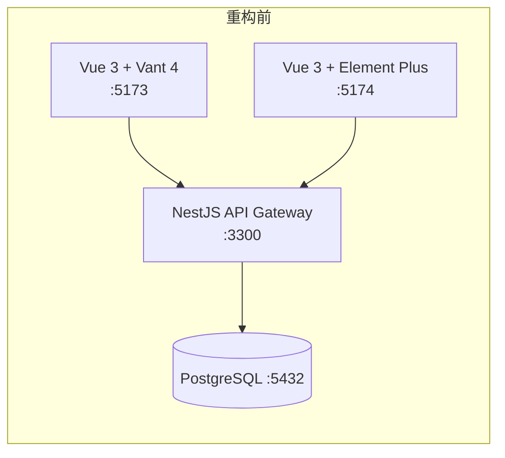
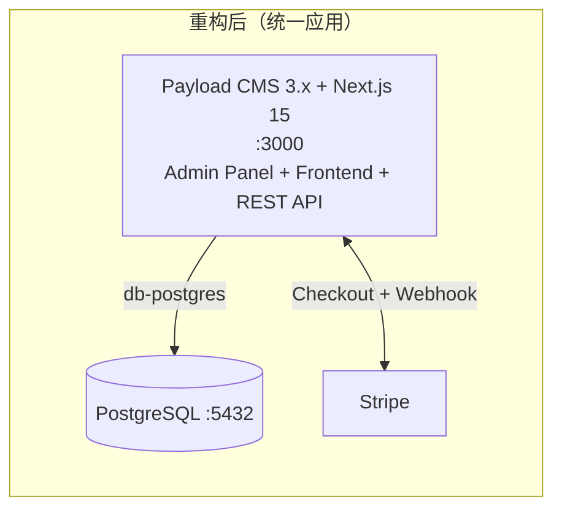
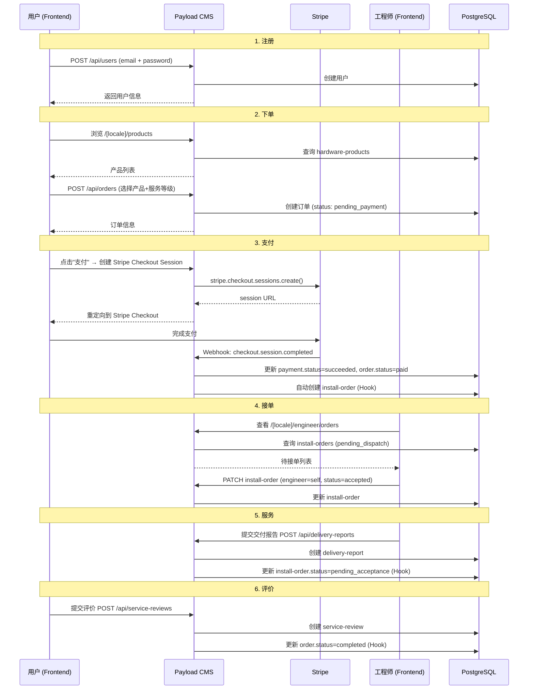
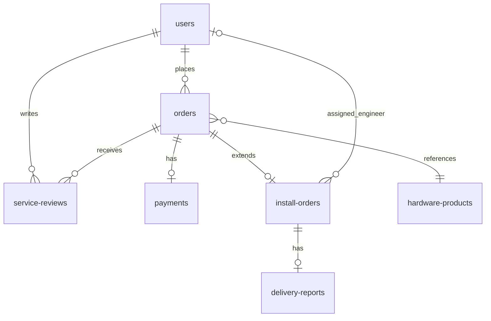

# 技术设计文档：Payload CMS 重构（MVP）

## 概述

本设计文档描述将 OpenClaw Club 平台重构为 Payload CMS 3.x 统一应用的 MVP 技术方案。

核心变更：
- **统一应用**：用户前端合并到 Payload CMS Next.js 应用的 `(frontend)` 路由组，移除独立 Vue 前端
- **MVP 精简**：从 18 个 Collections 精简到 8 个核心 Collections + Media
- **Stripe 支付**：Stripe Checkout + Webhook 替代自建担保交易
- **Payload Auth**：内置 email/password 认证，不使用 Clerk
- **UI 栈**：shadcn/ui + Tailwind CSS + next-intl（复用 SaaS-Boilerplate-1.7.7）
- **保留**：PostgreSQL 数据库（localhost:5432, user=justin, db=openclaw_club）

技术选型：
| 组件 | 选择 | 理由 |
|------|------|------|
| CMS 框架 | Payload CMS 3.79.0 | 已安装，TypeScript 原生，自动 Admin UI + REST API |
| 运行框架 | Next.js 15 | Payload 3.x 原生集成，SSR + App Router |
| 数据库 | @payloadcms/db-postgres | 直连现有 PostgreSQL |
| UI 组件 | shadcn/ui (Radix UI + Tailwind CSS) | 复用 SaaS-Boilerplate |
| 前端 i18n | next-intl | URL 路由 /[locale]/...，复用 SaaS-Boilerplate |
| 支付 | Stripe (stripe SDK) | SaaS-Boilerplate 已有依赖 |
| 表单 | react-hook-form + zod | 复用 SaaS-Boilerplate |
| 图标 | lucide-react | 复用 SaaS-Boilerplate |
| 富文本 | @payloadcms/richtext-lexical | Payload 默认 |

## 架构

### 重构前后对比





### 项目结构

```
openclaw-club-platform/
├── apps/
│   └── cms/                              # Payload CMS 统一应用
│       ├── src/
│       │   ├── app/
│       │   │   ├── (frontend)/           # 用户前端路由组
│       │   │   │   └── [locale]/         # next-intl 语言路由
│       │   │   │       ├── layout.tsx     # 前端布局（Header/Footer）
│       │   │   │       ├── page.tsx       # 首页
│       │   │   │       ├── products/
│       │   │   │       │   ├── page.tsx           # 产品列表
│       │   │   │       │   └── [id]/page.tsx      # 产品详情
│       │   │   │       ├── orders/
│       │   │   │       │   ├── page.tsx           # 我的订单
│       │   │   │       │   ├── new/page.tsx       # 创建订单
│       │   │   │       │   └── [id]/
│       │   │   │       │       ├── page.tsx       # 订单详情
│       │   │   │       │       ├── success/page.tsx  # 支付成功
│       │   │   │       │       ├── cancel/page.tsx   # 支付取消
│       │   │   │       │       └── review/page.tsx   # 评价
│       │   │   │       ├── engineer/
│       │   │   │       │   └── orders/
│       │   │   │       │       ├── page.tsx       # 工程师工作台
│       │   │   │       │       └── [id]/
│       │   │   │       │           └── report/page.tsx  # 交付报告
│       │   │   │       ├── auth/
│       │   │   │       │   ├── login/page.tsx
│       │   │   │       │   └── register/page.tsx
│       │   │   │       └── settings/page.tsx      # 用户设置
│       │   │   ├── (payload)/            # Payload Admin Panel
│       │   │   │   └── admin/
│       │   │   │       └── [[...segments]]/page.tsx
│       │   │   ├── api/
│       │   │   │   ├── [...slug]/route.ts         # Payload REST API
│       │   │   │   └── stripe-webhook/route.ts    # Stripe Webhook
│       │   │   ├── layout.tsx
│       │   │   └── page.tsx              # 根路由重定向到 /[locale]
│       │   ├── collections/              # 8 个核心 Collections
│       │   │   ├── Users.ts
│       │   │   ├── Orders.ts
│       │   │   ├── Payments.ts
│       │   │   ├── InstallOrders.ts
│       │   │   ├── DeliveryReports.ts
│       │   │   ├── ServiceReviews.ts
│       │   │   ├── HardwareProducts.ts
│       │   │   ├── AuditLogs.ts
│       │   │   └── Media.ts
│       │   ├── globals/
│       │   │   ├── SiteSettings.ts
│       │   │   ├── PricingConfig.ts
│       │   │   └── OcsasStandards.ts
│       │   ├── access/
│       │   │   ├── isAdmin.ts
│       │   │   ├── isAdminOrSelf.ts
│       │   │   └── isOwner.ts
│       │   ├── hooks/
│       │   │   ├── generateOrderNumber.ts
│       │   │   ├── createInstallOrder.ts
│       │   │   ├── completeOrderOnReview.ts
│       │   │   ├── updateOrderOnDelivery.ts
│       │   │   ├── writeAuditLog.ts
│       │   │   └── stripeWebhook.ts
│       │   ├── components/               # shadcn/ui 前端组件
│       │   │   ├── ui/                   # shadcn/ui 基础组件
│       │   │   │   ├── button.tsx
│       │   │   │   ├── card.tsx
│       │   │   │   ├── input.tsx
│       │   │   │   ├── select.tsx
│       │   │   │   ├── badge.tsx
│       │   │   │   └── ...
│       │   │   ├── Header.tsx
│       │   │   ├── Footer.tsx
│       │   │   ├── ProductCard.tsx
│       │   │   ├── OrderCard.tsx
│       │   │   └── ThemeToggle.tsx
│       │   ├── lib/
│       │   │   ├── stripe.ts             # Stripe SDK 初始化
│       │   │   └── utils.ts              # cn() 等工具函数
│       │   ├── migrations/
│       │   │   └── migrate-from-typeorm.ts
│       │   └── payload.config.ts
│       ├── messages/                     # next-intl 翻译文件
│       │   ├── zh.json
│       │   ├── en.json
│       │   ├── ja.json
│       │   ├── ko.json
│       │   ├── de.json
│       │   ├── fr.json
│       │   └── es.json
│       ├── i18n.ts                       # next-intl 配置
│       ├── middleware.ts                 # next-intl 中间件（locale 路由）
│       ├── tailwind.config.ts
│       ├── next.config.mjs
│       ├── tsconfig.json
│       ├── components.json              # shadcn/ui 配置
│       └── package.json
├── packages/
│   └── shared/                           # 共享类型（保留）
└── pnpm-workspace.yaml
```

### payload.config.ts 核心配置

```typescript
import { buildConfig } from 'payload'
import { postgresAdapter } from '@payloadcms/db-postgres'
import { lexicalEditor } from '@payloadcms/richtext-lexical'
import path from 'path'
import { fileURLToPath } from 'url'

import { Users } from './collections/Users'
import { Orders } from './collections/Orders'
import { Payments } from './collections/Payments'
import { InstallOrders } from './collections/InstallOrders'
import { DeliveryReports } from './collections/DeliveryReports'
import { ServiceReviews } from './collections/ServiceReviews'
import { HardwareProducts } from './collections/HardwareProducts'
import { AuditLogs } from './collections/AuditLogs'
import { Media } from './collections/Media'

import { SiteSettings } from './globals/SiteSettings'
import { PricingConfig } from './globals/PricingConfig'
import { OcsasStandards } from './globals/OcsasStandards'

const filename = fileURLToPath(import.meta.url)
const dirname = path.dirname(filename)

export default buildConfig({
  serverURL: process.env.PAYLOAD_PUBLIC_SERVER_URL || 'http://localhost:3000',
  admin: {
    user: Users.slug,
    meta: { titleSuffix: '- OpenClaw Club' },
  },
  collections: [
    Users, Orders, Payments, InstallOrders,
    DeliveryReports, ServiceReviews, HardwareProducts,
    AuditLogs, Media,
  ],
  globals: [SiteSettings, PricingConfig, OcsasStandards],
  db: postgresAdapter({
    pool: {
      connectionString: process.env.DATABASE_URI
        || 'postgresql://justin@localhost:5432/openclaw_club',
    },
    push: process.env.NODE_ENV !== 'production',
  }),
  editor: lexicalEditor(),
  i18n: { fallbackLanguage: 'zh' },
  localization: {
    locales: [
      { label: '中文', code: 'zh' },
      { label: 'English', code: 'en' },
      { label: '日本語', code: 'ja' },
      { label: '한국어', code: 'ko' },
      { label: 'Deutsch', code: 'de' },
      { label: 'Français', code: 'fr' },
      { label: 'Español', code: 'es' },
    ],
    defaultLocale: 'zh',
    fallbackLocale: 'en',
  },
  typescript: { outputFile: path.resolve(dirname, 'payload-types.ts') },
})
```

### Stripe Webhook 路由

```typescript
// app/api/stripe-webhook/route.ts
import { NextRequest, NextResponse } from 'next/server'
import Stripe from 'stripe'
import { getPayload } from 'payload'
import config from '@payload-config'

const stripe = new Stripe(process.env.STRIPE_SECRET_KEY!)

export async function POST(req: NextRequest) {
  const body = await req.text()
  const sig = req.headers.get('stripe-signature')!

  let event: Stripe.Event
  try {
    event = stripe.webhooks.constructEvent(body, sig, process.env.STRIPE_WEBHOOK_SECRET!)
  } catch (err) {
    return NextResponse.json({ error: 'Invalid signature' }, { status: 400 })
  }

  if (event.type === 'checkout.session.completed') {
    const session = event.data.object as Stripe.Checkout.Session
    const payload = await getPayload({ config })

    // 更新 payment 状态
    const payments = await payload.find({
      collection: 'payments',
      where: { stripeSessionId: { equals: session.id } },
      limit: 1,
    })

    if (payments.docs.length > 0) {
      const payment = payments.docs[0]
      await payload.update({
        collection: 'payments',
        id: payment.id,
        data: {
          status: 'succeeded',
          stripePaymentIntentId: session.payment_intent as string,
        },
        overrideAccess: true,
      })

      // 更新 order 状态为 paid
      await payload.update({
        collection: 'orders',
        id: payment.order as string,
        data: { status: 'paid' },
        overrideAccess: true,
      })
    }
  }

  return NextResponse.json({ received: true })
}
```

### next-intl 配置

```typescript
// i18n.ts
import { getRequestConfig } from 'next-intl/server'

export const locales = ['zh', 'en', 'ja', 'ko', 'de', 'fr', 'es'] as const
export const defaultLocale = 'zh'

export default getRequestConfig(async ({ locale }) => ({
  messages: (await import(`./messages/${locale}.json`)).default,
}))
```

```typescript
// middleware.ts
import createMiddleware from 'next-intl/middleware'
import { locales, defaultLocale } from './i18n'

export default createMiddleware({
  locales,
  defaultLocale,
  localePrefix: 'always',
})

export const config = {
  matcher: ['/((?!api|_next|admin|media).*)'],
}
```

## 组件与接口

### Collections 定义

#### 1. Users Collection（需求 2）

```typescript
import type { CollectionConfig } from 'payload'
import { isAdmin, isAdminOrSelf } from '../access/roles'
import { writeAuditLog } from '../hooks/writeAuditLog'

export const Users: CollectionConfig = {
  slug: 'users',
  auth: {
    tokenExpiration: 86400,
  },
  admin: {
    useAsTitle: 'displayName',
    group: '用户管理',
    listSearchableFields: ['email', 'displayName'],
    defaultColumns: ['displayName', 'email', 'role', 'region'],
  },
  access: {
    create: () => true,
    read: isAdminOrSelf,
    update: isAdminOrSelf,
    delete: isAdmin,
  },
  hooks: {
    afterChange: [writeAuditLog('users')],
  },
  fields: [
    {
      name: 'displayName',
      type: 'text',
      maxLength: 100,
      dbName: 'display_name',
    },
    {
      name: 'avatarUrl',
      type: 'upload',
      relationTo: 'media',
    },
    {
      name: 'languagePreference',
      type: 'select',
      defaultValue: 'zh',
      options: ['zh', 'en', 'ja', 'ko', 'de', 'fr', 'es'],
      dbName: 'language_preference',
    },
    {
      name: 'timezone',
      type: 'text',
      defaultValue: 'UTC',
    },
    {
      name: 'region',
      type: 'select',
      options: [
        { label: '亚太', value: 'apac' },
        { label: '北美', value: 'na' },
        { label: '欧洲', value: 'eu' },
      ],
    },
    {
      name: 'role',
      type: 'select',
      required: true,
      defaultValue: 'individual_user',
      access: { update: isAdmin },
      options: [
        { label: '管理员', value: 'admin' },
        { label: '认证工程师', value: 'certified_engineer' },
        { label: '个人用户', value: 'individual_user' },
      ],
    },
  ],
}
```

#### 2. Orders Collection（需求 4）

```typescript
import type { CollectionConfig } from 'payload'
import { isAdmin } from '../access/roles'
import { generateOrderNumber } from '../hooks/generateOrderNumber'
import { createInstallOrder } from '../hooks/createInstallOrder'

export const Orders: CollectionConfig = {
  slug: 'orders',
  admin: {
    useAsTitle: 'orderNumber',
    group: '订单管理',
    defaultColumns: ['orderNumber', 'user', 'status', 'totalAmount', 'createdAt'],
    listSearchableFields: ['orderNumber'],
  },
  access: {
    create: ({ req: { user } }) => !!user,
    read: ({ req: { user } }) => {
      if (!user) return false
      if (user.role === 'admin') return true
      return { user: { equals: user.id } }
    },
    update: isAdmin,
    delete: isAdmin,
  },
  hooks: {
    beforeChange: [generateOrderNumber],
    afterChange: [createInstallOrder],
  },
  fields: [
    {
      name: 'orderNumber',
      type: 'text',
      unique: true,
      dbName: 'order_number',
      access: { update: () => false },
      admin: { readOnly: true },
    },
    { name: 'user', type: 'relationship', relationTo: 'users', required: true },
    {
      name: 'status',
      type: 'select',
      required: true,
      defaultValue: 'pending_payment',
      options: [
        'pending_payment', 'paid', 'dispatched', 'accepted',
        'in_progress', 'completed', 'cancelled',
      ],
    },
    { name: 'totalAmount', type: 'number', required: true, min: 0, dbName: 'total_amount' },
    { name: 'currency', type: 'text', defaultValue: 'USD', maxLength: 3 },
    { name: 'region', type: 'select', options: ['apac', 'na', 'eu'] },
    { name: 'product', type: 'relationship', relationTo: 'hardware-products' },
    {
      name: 'serviceTier',
      type: 'select',
      options: ['standard', 'professional', 'enterprise'],
      dbName: 'service_tier',
    },
  ],
}
```

#### 3. Payments Collection（需求 5）

```typescript
import type { CollectionConfig } from 'payload'
import { isAdmin } from '../access/roles'

export const Payments: CollectionConfig = {
  slug: 'payments',
  admin: {
    group: '订单管理',
    defaultColumns: ['order', 'amount', 'status', 'createdAt'],
  },
  access: {
    create: ({ req: { user } }) => !!user,
    read: ({ req: { user } }) => {
      if (!user) return false
      if (user.role === 'admin') return true
      return { 'order.user': { equals: user.id } }
    },
    update: isAdmin,
    delete: isAdmin,
  },
  fields: [
    { name: 'order', type: 'relationship', relationTo: 'orders', required: true },
    { name: 'amount', type: 'number', required: true, min: 0, access: { update: () => false } },
    { name: 'currency', type: 'text', defaultValue: 'USD', maxLength: 3 },
    {
      name: 'status',
      type: 'select',
      required: true,
      defaultValue: 'pending',
      options: ['pending', 'succeeded', 'failed', 'refunded'],
    },
    { name: 'stripeSessionId', type: 'text', dbName: 'stripe_session_id' },
    { name: 'stripePaymentIntentId', type: 'text', dbName: 'stripe_payment_intent_id' },
  ],
}
```

#### 4. InstallOrders Collection（需求 6）

```typescript
import type { CollectionConfig } from 'payload'
import { isAdmin } from '../access/roles'
import { writeAuditLog } from '../hooks/writeAuditLog'

export const InstallOrders: CollectionConfig = {
  slug: 'install-orders',
  admin: {
    group: '订单管理',
    defaultColumns: ['order', 'serviceTier', 'installStatus', 'engineer', 'createdAt'],
  },
  access: {
    create: isAdmin,
    read: ({ req: { user } }) => {
      if (!user) return false
      if (user.role === 'admin') return true
      if (user.role === 'certified_engineer') return { engineer: { equals: user.id } }
      return { 'order.user': { equals: user.id } }
    },
    update: ({ req: { user } }) => {
      if (!user) return false
      if (user.role === 'admin') return true
      if (user.role === 'certified_engineer') return { engineer: { equals: user.id } }
      return false
    },
    delete: isAdmin,
  },
  hooks: {
    afterChange: [writeAuditLog('install-orders')],
  },
  fields: [
    { name: 'order', type: 'relationship', relationTo: 'orders', required: true },
    {
      name: 'serviceTier',
      type: 'select',
      required: true,
      options: ['standard', 'professional', 'enterprise'],
      dbName: 'service_tier',
    },
    { name: 'ocsasLevel', type: 'number', required: true, defaultValue: 1, min: 1, max: 3, dbName: 'ocsas_level' },
    { name: 'engineer', type: 'relationship', relationTo: 'users' },
    {
      name: 'installStatus',
      type: 'select',
      required: true,
      defaultValue: 'pending_dispatch',
      options: ['pending_dispatch', 'accepted', 'in_progress', 'pending_acceptance', 'completed'],
      dbName: 'install_status',
    },
    { name: 'acceptedAt', type: 'date', dbName: 'accepted_at', admin: { date: { pickerAppearance: 'dayAndTime' } } },
    { name: 'completedAt', type: 'date', dbName: 'completed_at', admin: { date: { pickerAppearance: 'dayAndTime' } } },
  ],
}
```

#### 5. DeliveryReports Collection（需求 7）

```typescript
import type { CollectionConfig } from 'payload'
import { isAdmin } from '../access/roles'
import { updateOrderOnDelivery } from '../hooks/updateOrderOnDelivery'

export const DeliveryReports: CollectionConfig = {
  slug: 'delivery-reports',
  admin: { group: '订单管理' },
  access: {
    create: ({ req: { user } }) => user?.role === 'admin' || user?.role === 'certified_engineer',
    read: ({ req: { user } }) => {
      if (!user) return false
      if (user.role === 'admin') return true
      return { 'installOrder.engineer': { equals: user.id } }
    },
    update: isAdmin,
    delete: isAdmin,
  },
  hooks: {
    afterChange: [updateOrderOnDelivery],
  },
  fields: [
    { name: 'installOrder', type: 'relationship', relationTo: 'install-orders', required: true, dbName: 'install_order_id' },
    { name: 'checklist', type: 'json', required: true },
    { name: 'configItems', type: 'json', required: true, dbName: 'config_items' },
    { name: 'testResults', type: 'json', required: true, dbName: 'test_results' },
    {
      name: 'screenshots',
      type: 'array',
      fields: [{ name: 'image', type: 'upload', relationTo: 'media' }],
    },
  ],
}
```

#### 6. ServiceReviews Collection（需求 8）

```typescript
import type { CollectionConfig } from 'payload'
import { completeOrderOnReview } from '../hooks/completeOrderOnReview'

export const ServiceReviews: CollectionConfig = {
  slug: 'service-reviews',
  admin: { group: '订单管理' },
  access: {
    create: ({ req: { user } }) => !!user,
    read: () => true,
    update: ({ req: { user } }) => {
      if (!user) return false
      if (user.role === 'admin') return true
      return { user: { equals: user.id } }
    },
    delete: ({ req: { user } }) => user?.role === 'admin',
  },
  hooks: {
    afterChange: [completeOrderOnReview],
  },
  fields: [
    { name: 'order', type: 'relationship', relationTo: 'orders', required: true },
    { name: 'user', type: 'relationship', relationTo: 'users', required: true },
    { name: 'overallRating', type: 'number', required: true, min: 1, max: 5, dbName: 'overall_rating' },
    { name: 'attitudeRating', type: 'number', min: 1, max: 5, dbName: 'attitude_rating' },
    { name: 'skillRating', type: 'number', min: 1, max: 5, dbName: 'skill_rating' },
    { name: 'comment', type: 'textarea' },
  ],
}
```

#### 7. HardwareProducts Collection（需求 3）

```typescript
import type { CollectionConfig } from 'payload'
import { isAdmin } from '../access/roles'

export const HardwareProducts: CollectionConfig = {
  slug: 'hardware-products',
  admin: {
    useAsTitle: 'name',
    group: '产品管理',
  },
  access: {
    create: isAdmin,
    read: () => true,
    update: isAdmin,
    delete: isAdmin,
  },
  fields: [
    {
      name: 'category',
      type: 'select',
      required: true,
      options: ['clawbox_lite', 'clawbox_pro', 'clawbox_enterprise', 'recommended_hardware', 'accessories'],
    },
    { name: 'name', type: 'text', required: true, localized: true },
    { name: 'description', type: 'textarea', required: true, localized: true },
    { name: 'specs', type: 'json', required: true, localized: true },
    { name: 'price', type: 'number', required: true, min: 0 },
    { name: 'stockByRegion', type: 'json', dbName: 'stock_by_region' },
    { name: 'isActive', type: 'checkbox', defaultValue: true, dbName: 'is_active' },
  ],
}
```

#### 8. AuditLogs Collection（需求 11）

```typescript
import type { CollectionConfig } from 'payload'
import { isAdmin } from '../access/roles'

export const AuditLogs: CollectionConfig = {
  slug: 'audit-logs',
  admin: {
    group: '系统管理',
    defaultColumns: ['action', 'resourceType', 'user', 'createdAt'],
  },
  access: {
    create: () => false,
    read: isAdmin,
    update: () => false,
    delete: () => false,
  },
  fields: [
    { name: 'user', type: 'relationship', relationTo: 'users' },
    { name: 'action', type: 'text', required: true, maxLength: 100 },
    { name: 'resourceType', type: 'text', required: true, maxLength: 50, dbName: 'resource_type' },
    { name: 'resourceId', type: 'text', maxLength: 64, dbName: 'resource_id' },
    { name: 'details', type: 'json' },
    { name: 'ipAddress', type: 'text', dbName: 'ip_address' },
  ],
}
```

#### 9. Media Collection（需求 9）

```typescript
import type { CollectionConfig } from 'payload'

export const Media: CollectionConfig = {
  slug: 'media',
  upload: {
    mimeTypes: ['image/jpeg', 'image/png', 'image/webp', 'image/svg+xml'],
    staticDir: 'media',
    imageSizes: [
      { name: 'thumbnail', width: 300, height: 300, position: 'centre' },
      { name: 'card', width: 768, height: 1024, position: 'centre' },
    ],
  },
  access: {
    create: ({ req: { user } }) => !!user,
    read: () => true,
    update: ({ req: { user } }) => !!user,
    delete: ({ req: { user } }) => user?.role === 'admin',
  },
  fields: [
    { name: 'alt', type: 'text' },
  ],
}
```

### Globals 定义

#### SiteSettings（需求 10）

```typescript
import type { GlobalConfig } from 'payload'
import { isAdmin } from '../access/roles'

export const SiteSettings: GlobalConfig = {
  slug: 'site-settings',
  admin: { group: '系统管理' },
  access: { read: () => true, update: isAdmin },
  fields: [
    { name: 'platformName', type: 'text', defaultValue: 'OpenClaw Club', localized: true },
    { name: 'logoUrl', type: 'text' },
    { name: 'defaultLanguage', type: 'select', defaultValue: 'zh', options: ['zh', 'en', 'ja', 'ko', 'de', 'fr', 'es'] },
    { name: 'contactEmail', type: 'email' },
  ],
}
```

#### PricingConfig（需求 10）

```typescript
import type { GlobalConfig } from 'payload'
import { isAdmin } from '../access/roles'

export const PricingConfig: GlobalConfig = {
  slug: 'pricing-config',
  admin: { group: '系统管理' },
  access: { read: () => true, update: isAdmin },
  fields: [
    {
      name: 'installationPricing',
      type: 'group',
      fields: [
        { name: 'standard', type: 'number', defaultValue: 99 },
        { name: 'professional', type: 'number', defaultValue: 299 },
        { name: 'enterprise', type: 'number', defaultValue: 999 },
      ],
    },
  ],
}
```

#### OcsasStandards（需求 10）

```typescript
import type { GlobalConfig } from 'payload'
import { isAdmin } from '../access/roles'

export const OcsasStandards: GlobalConfig = {
  slug: 'ocsas-standards',
  admin: { group: '系统管理' },
  access: { read: () => true, update: isAdmin },
  fields: [
    {
      name: 'levels',
      type: 'array',
      fields: [
        { name: 'level', type: 'number', required: true, min: 1, max: 3 },
        { name: 'name', type: 'text', required: true, localized: true },
        { name: 'description', type: 'textarea', localized: true },
        {
          name: 'checklistItems',
          type: 'array',
          fields: [
            { name: 'item', type: 'text', required: true, localized: true },
            { name: 'category', type: 'text' },
            { name: 'required', type: 'checkbox', defaultValue: true },
          ],
        },
      ],
    },
  ],
}
```

### Access Control 函数

```typescript
// access/isAdmin.ts
import type { Access } from 'payload'
export const isAdmin: Access = ({ req: { user } }) => user?.role === 'admin'

// access/isAdminOrSelf.ts
import type { Access } from 'payload'
export const isAdminOrSelf: Access = ({ req: { user } }) => {
  if (!user) return false
  if (user.role === 'admin') return true
  return { id: { equals: user.id } }
}

// access/isOwner.ts
import type { Access } from 'payload'
export const isOwner = (userField = 'user'): Access => ({ req: { user } }) => {
  if (!user) return false
  if (user.role === 'admin') return true
  return { [userField]: { equals: user.id } }
}
```

### Hooks 实现

#### 订单编号生成

```typescript
// hooks/generateOrderNumber.ts
import type { CollectionBeforeChangeHook } from 'payload'

export const generateOrderNumber: CollectionBeforeChangeHook = async ({ data, operation }) => {
  if (operation === 'create') {
    const now = new Date()
    const dateStr = now.toISOString().slice(0, 10).replace(/-/g, '')
    const random = Math.random().toString(36).substring(2, 7).toUpperCase()
    data.orderNumber = `OC-${dateStr}-${random}`
  }
  return data
}
```

#### 支付成功后自动创建安装订单

```typescript
// hooks/createInstallOrder.ts
import type { CollectionAfterChangeHook } from 'payload'

export const createInstallOrder: CollectionAfterChangeHook = async ({
  doc, previousDoc, req, operation,
}) => {
  // 当订单状态从 pending_payment 变为 paid 时，自动创建 install-order
  if (operation === 'update' && doc.status === 'paid' && previousDoc?.status !== 'paid') {
    await req.payload.create({
      collection: 'install-orders',
      data: {
        order: doc.id,
        serviceTier: doc.serviceTier || 'standard',
        ocsasLevel: 1,
        installStatus: 'pending_dispatch',
      },
      overrideAccess: true,
    })
  }
}
```

#### 交付报告提交后更新安装订单状态

```typescript
// hooks/updateOrderOnDelivery.ts
import type { CollectionAfterChangeHook } from 'payload'

export const updateOrderOnDelivery: CollectionAfterChangeHook = async ({
  doc, req, operation,
}) => {
  if (operation === 'create') {
    await req.payload.update({
      collection: 'install-orders',
      id: doc.installOrder as string,
      data: { installStatus: 'pending_acceptance' },
      overrideAccess: true,
    })
  }
}
```

#### 用户评价后完成订单

```typescript
// hooks/completeOrderOnReview.ts
import type { CollectionAfterChangeHook } from 'payload'

export const completeOrderOnReview: CollectionAfterChangeHook = async ({
  doc, req, operation,
}) => {
  if (operation === 'create') {
    await req.payload.update({
      collection: 'orders',
      id: doc.order as string,
      data: { status: 'completed' },
      overrideAccess: true,
    })
  }
}
```

#### 审计日志写入

```typescript
// hooks/writeAuditLog.ts
import type { CollectionAfterChangeHook } from 'payload'

export const writeAuditLog = (resourceType: string): CollectionAfterChangeHook => async ({
  doc, previousDoc, req, operation,
}) => {
  const action = operation === 'create' ? 'create' : 'update'
  let details: Record<string, unknown> = {}

  if (operation === 'update' && previousDoc) {
    if (resourceType === 'users' && previousDoc.role !== doc.role) {
      details = { field: 'role', from: previousDoc.role, to: doc.role }
    }
    if (resourceType === 'install-orders' && previousDoc.installStatus !== doc.installStatus) {
      details = { field: 'installStatus', from: previousDoc.installStatus, to: doc.installStatus }
    }
  }

  await req.payload.create({
    collection: 'audit-logs',
    data: {
      user: req.user?.id || null,
      action: `${resourceType}.${action}`,
      resourceType,
      resourceId: String(doc.id),
      details,
      ipAddress: req.headers?.get?.('x-forwarded-for') || null,
    },
    overrideAccess: true,
  })
}
```

#### Stripe Checkout 创建

```typescript
// lib/stripe.ts
import Stripe from 'stripe'

export const stripe = new Stripe(process.env.STRIPE_SECRET_KEY!, {
  apiVersion: '2024-06-20',
})

export async function createCheckoutSession(params: {
  orderId: string
  amount: number
  currency: string
  successUrl: string
  cancelUrl: string
}) {
  return stripe.checkout.sessions.create({
    payment_method_types: ['card'],
    line_items: [{
      price_data: {
        currency: params.currency.toLowerCase(),
        product_data: { name: `Order ${params.orderId}` },
        unit_amount: Math.round(params.amount * 100),
      },
      quantity: 1,
    }],
    mode: 'payment',
    success_url: params.successUrl,
    cancel_url: params.cancelUrl,
    metadata: { orderId: params.orderId },
  })
}
```

### 核心业务流程



## 数据模型

### 角色权限矩阵（MVP 精简版）

| Collection | admin | certified_engineer | individual_user | 访客 |
|---|---|---|---|---|
| users | CRUD | R(self) | RU(self) | - |
| orders | CRUD | - | CR(self) | - |
| payments | CRUD | - | R(self) | - |
| install-orders | CRUD | RU(assigned) | R(self) | - |
| delivery-reports | CRUD | CR(assigned) | - | - |
| service-reviews | CRUD | - | CRU(self) | R |
| hardware-products | CRUD | R | R | R |
| audit-logs | R | - | - | - |
| media | CRUD | CRU | CRU | R |

### 实体关系图



### 数据迁移策略

Payload CMS 通过 `push: true` 自动同步 schema。关键迁移点：

| 迁移项 | 处理方式 |
|---|---|
| users.password_hash (bcrypt) | Payload Auth 内部也使用 bcrypt，直接映射到 hash 字段 |
| 外键列 (user_id 等) | 通过 dbName 映射确保 Payload relationship 字段对应正确列 |
| 种子数据 (10 users, 6 orders, 3 products) | 通过 dbName 映射确保 Payload 能直接读取 |
| 被移除的 Collections 对应的表 | 保留在数据库中不删除，Payload 不管理这些表 |

```typescript
// migrations/migrate-from-typeorm.ts
import { getPayload } from 'payload'
import config from '@payload-config'

interface MigrationResult {
  table: string
  status: 'success' | 'failed' | 'skipped'
  rowsAffected: number
  error?: string
}

export async function migrateFromTypeORM(): Promise<MigrationResult[]> {
  const payload = await getPayload({ config })
  const results: MigrationResult[] = []

  // 迁移用户密码
  try {
    const { rowCount } = await payload.db.pool.query(`
      UPDATE users SET hash = password_hash
      WHERE password_hash IS NOT NULL AND hash IS NULL
    `)
    results.push({ table: 'users', status: 'success', rowsAffected: rowCount || 0 })
  } catch (error) {
    results.push({ table: 'users', status: 'failed', rowsAffected: 0, error: (error as Error).message })
  }

  // 验证核心表数据完整性
  const coreTables = ['users', 'orders', 'payments', 'install_orders', 'delivery_reports', 'service_reviews', 'hardware_products', 'audit_logs']
  for (const table of coreTables) {
    try {
      const { rows } = await payload.db.pool.query(`SELECT COUNT(*) as count FROM ${table}`)
      results.push({ table, status: 'success', rowsAffected: Number(rows[0].count) })
    } catch (error) {
      results.push({ table, status: 'failed', rowsAffected: 0, error: (error as Error).message })
    }
  }

  console.log('\n=== 迁移报告 ===')
  for (const r of results) {
    console.log(`[${r.status.toUpperCase()}] ${r.table}: ${r.rowsAffected} 行 ${r.error ? `- ${r.error}` : ''}`)
  }
  return results
}
```

## 正确性属性 (Correctness Properties)

### Property 1: 访问控制强制执行

*对于任何*用户角色和任何 Collection 操作，访问控制函数应正确执行权限规则：admin 可访问所有资源；普通用户只能访问自己的数据；未认证请求访问受保护端点应返回 401。

**Validates: Requirements 2.5, 4.5, 5.6, 6.5, 7.4, 8.3, 11.2**

### Property 2: 订单编号格式唯一性

*对于任何*创建的订单，其订单编号应匹配格式 `OC-YYYYMMDD-XXXXX` 且在所有订单中唯一。

**Validates: Requirements 4.3**

### Property 3: Stripe 支付流程完整性

*对于任何*成功的 Stripe Checkout Session，Webhook 处理后 payment.status 应为 succeeded，关联 order.status 应为 paid，且应自动创建 install-order。

**Validates: Requirements 5.3, 5.4, 6.2**

### Property 4: 核心业务流程状态一致性

*对于任何*完整的业务流程（下单→支付→接单→服务→评价），各实体状态应保持一致：order 从 pending_payment → paid → completed；install-order 从 pending_dispatch → accepted → in_progress → pending_acceptance → completed。

**Validates: Requirements 4.6, 6.6, 7.3, 8.4**

### Property 5: 关键变更审计日志

*对于任何* users 的角色变更或 install-orders 的状态变更，系统应自动在 audit-logs 中写入一条记录。

**Validates: Requirements 11.3, 11.4**

### Property 6: 内容本地化正确性

*对于任何*含 `localized: true` 字段的 Collection/Global，当 API 请求附带 `?locale=X` 参数时，返回的字段内容应为该 locale 版本；无翻译时回退到 en。

**Validates: Requirements 3.5, 3.6, 12.1, 12.2, 12.3, 12.4**

### Property 7: 字段级访问控制

*对于任何*非 admin 用户，users.role 字段和 orders.orderNumber 字段和 payments.amount 字段的更新请求应被静默忽略。

**Validates: Requirements 2.6, 2.7, 4.4, 5.6**

### Property 8: Stripe Webhook 签名验证

*对于任何*收到的 Webhook 请求，如果签名验证失败，系统应返回 400 且不更新任何数据。

**Validates: Requirements 5.5**

## 错误处理

| 错误类型 | HTTP 状态码 | 处理方式 |
|---|---|---|
| 未认证 | 401 | Payload 内置处理 |
| 无权限 | 403 | Access Control 返回 false |
| 资源不存在 | 404 | Payload 内置处理 |
| 验证失败 | 400 | Field validation 或 Hook throw APIError |
| Stripe Webhook 签名无效 | 400 | 返回错误，不处理事件 |
| Stripe Webhook 处理失败 | 500 | 记录日志，Stripe 自动重试 |
| 数据库连接失败 | - | 启动时检测，输出错误并终止 |

## 测试策略

- **单元测试**：Hook 函数（generateOrderNumber、writeAuditLog 等）
- **属性测试**：使用 fast-check + vitest 验证正确性属性
- **集成测试**：Stripe Webhook 处理流程、完整业务流程
